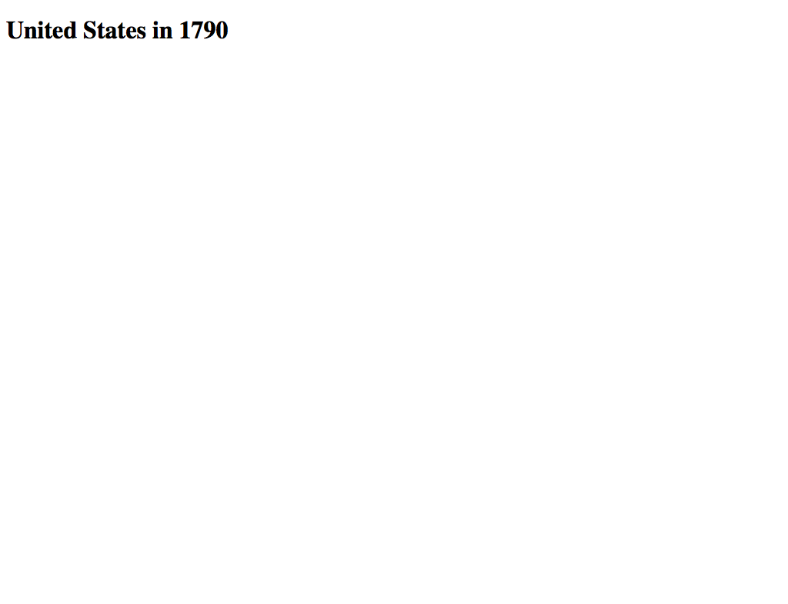
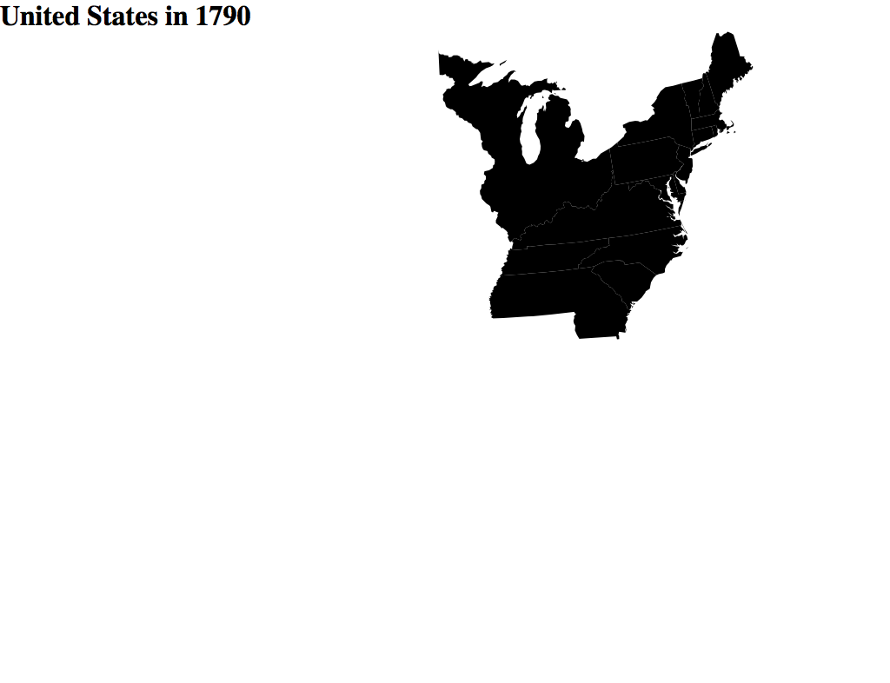
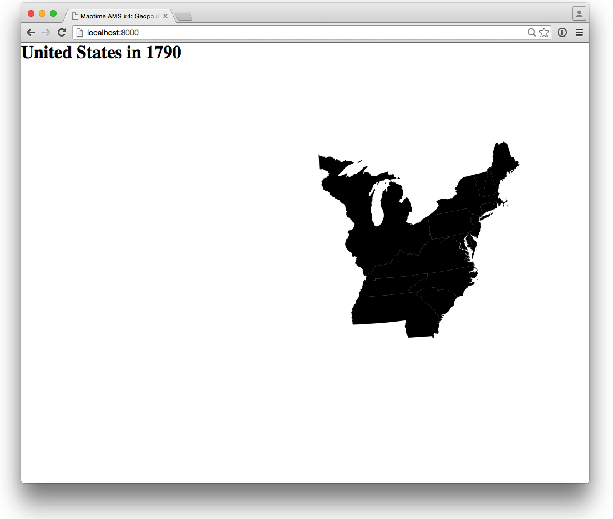
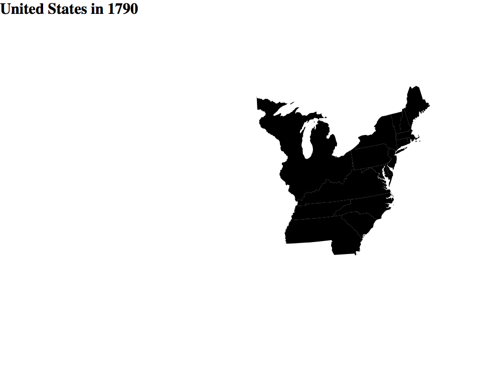
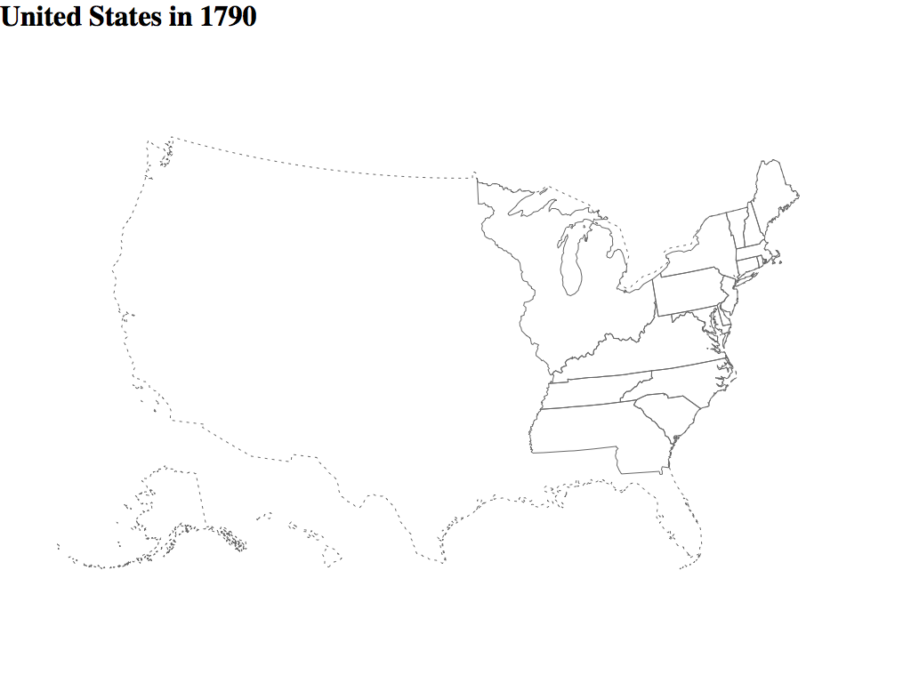
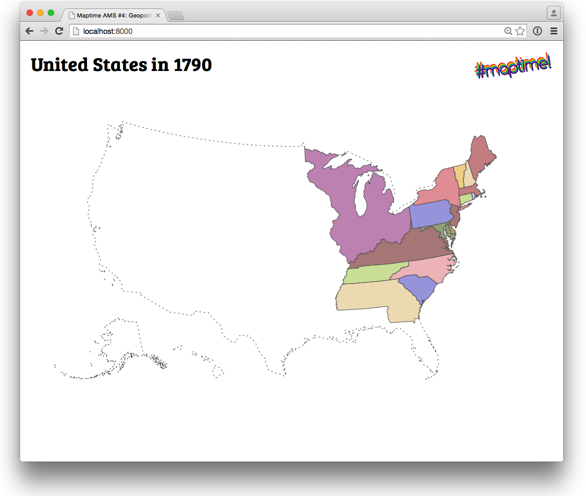
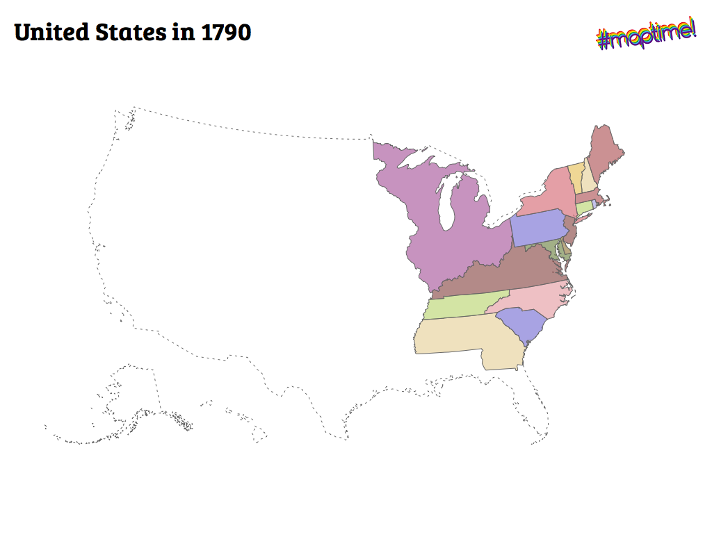
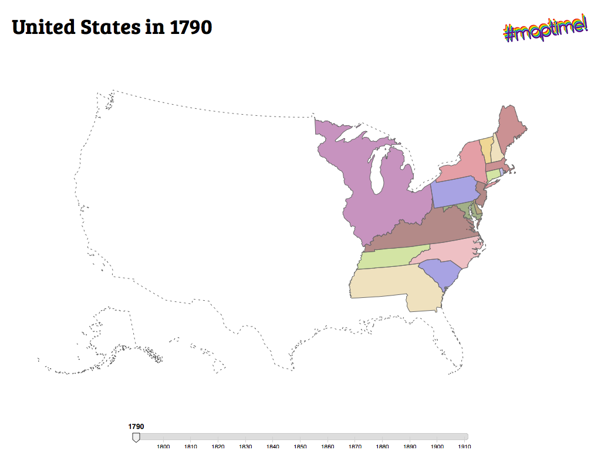

# D3.js - animated U.S. states border map

This is a step-by-step tutorial on making an animated map of the changing borders of U.S. states through history, using [D3.js](http://d3js.org/). This tutorial was made for [Maptime Amsterdam](http://maptime-ams.github.io/)'s [fourth Meetup](http://www.meetup.com/Maptime-AMS/events/220184135/), on February 18th, 2015.

To complete this tutorial, you need two things:

- __A modern browser__, like Firefox, Safari, Chrome, or a recent version of Internet Explorer. I like Chrome, because it's a faster when it comes to SVG rendering and animation.
- __A good text editor__, for example [Sublime Text](http://www.sublimetext.com/), [Textmate](http://macromates.com/) or [Notepad++](http://notepad-plus-plus.org/).

### D3.js

In this tutorial, we'll use [D3.js](http://d3js.org/) to convert [GeoJSON files](http://geojson.org/) to SVG, and draw and animate them in the browser. D3.js is an extremely powerful data manipulation and visualization library, written in JavaScript. From d3js.org:

> D3.js is a JavaScript library for manipulating documents based on data. D3 helps you bring data to life using HTML, SVG, and CSS. D3’s emphasis on web standards gives you the full capabilities of modern browsers without tying yourself to a proprietary framework, combining powerful visualization components and a data-driven approach to DOM manipulation.

D3 is _hard_ for beginners. This tutorial will guide you through the process of making a map using D3, it will point you to useful tools and techniques and it will give you an overview of D3's mapping possibilities, but there is no way you can learn D3 in one night. Luckily, D3's documentation is very good, there are many online tutorials and examples available to help you. It's recommended that you'll have a look at some of the links below before you start with the tutorial.

- [D3 documentation](https://github.com/mbostock/d3/wiki)
- [D3 tutorials](https://github.com/mbostock/d3/wiki/Tutorials)
- [Mike Bostock's examples](http://bl.ocks.org/mbostock)
- [Scott Murray's D3 tutorials](http://alignedleft.com/tutorials/d3)

There's also a lot of information available about making maps with D3:

- [Mike Bostock's map tutorial](http://bost.ocks.org/mike/map/)
- [Jason Davies' maps and visualizations](http://www.jasondavies.com/)
- [Maptime Seattle's Mapping with D3.js](http://maptimesea.github.io/2015/01/07/d3-mapping.html)
- [Maptime Boston's D3 tutorial](http://maptimeboston.github.io/d3-maptime/)
- [Ian Johnson's tutorials](http://enjalot.github.io/intro-d3/maptime/)

## Let's get started!

We'll start by cloning or downloading the [`animated-borders-d3js` repository](https://github.com/maptime-ams/animated-borders-d3js) from GitHub. If you have Git installed, simply go to your terminal and type:

    git clone https://github.com/maptime-ams/animated-borders-d3js.git

(If you have GitHub's [Mac](https://mac.github.com/) or [Windows](https://windows.github.com) client installed, you can also easily click the _Clone in Desktop_ button!)

If you don't have Git installed, you should install Git. It's easy. On your Mac, just install [Homebrew](http://brew.sh/) and then type `brew install git`. For installation on Windows, see [git-scm.com](http://git-scm.com/book/en/v2/Getting-Started-Installing-Git#Installing-on-Windows) for more information. And if you're using Linux, you'll probably already have Git installed (and don't need any explaining anyway).

- __I don't want to install Git!__
- You don't have to! You can also just download this tutorial as a [ZIP file](https://github.com/maptime-ams/animated-borders-d3js/archive/gh-pages.zip)!

If you've cloned the repository, browse to the tutorial's directory to get started. If you've downloaded the ZIP file, unzip it, and do the same.

## Step 0: Data

D3.js is all about data. In this tutorial, we'll use geo-spatial files containing U.S. state boundaries from the [National Historical Geographic Information System](https://www.nhgis.org/):

> The National Historical Geographic Information System (NHGIS) provides, free of charge, aggregate census data and GIS-compatible boundary files for the United States between 1790 and 2013.

After 1910, the borders of the states did not change much anymore, so we'll use data from 1790 to 1910.

### Download and convert NHGIS data yourself

_You don't have to download and convert NHGIS data, this tutorial comes with all the data you need. You can just skip this section!_

To download and convert the data needed for this tutorial yourself, follow these steps:

1. Get Shapefiles with state data, per year
  - You can use [the NHGIS Data Finder](https://data2.nhgis.org/main) to select the data you need,
  - Or simply download [`animated-borders-d3js.zip`](https://dl.dropboxusercontent.com/u/12905316/maptime/4/animated-borders-d3js.zip) from Maptime Amsterdam's Dropbox
2. Move/copy the zipped Shapefiles to the data directory (the files should be named `nhgis0001_shapefile_tl2000_us_state_XXXX.zip`)
3. Convert the Shapefiles to [TopoJSON](https://github.com/mbostock/topojson/wiki)!

To do this, you need to install [shp2json](https://github.com/substack/shp2json) and TopoJSON, and you need [Node.js](http://nodejs.org/).

    brew install node
    npm install -g shp2json
    npm install -g topojson

Afterwards, you can convert a Shapefile to TopoJSON by running shp2json and piping its output to TopoJSON:

    shp2json <shapefile> | topojson -p STATENAM -s 1e-6

Or, run `shp2topojson.sh`, a convenient script that comes with this tutorial:

    cd scripts
    ./shp2topojson.sh

### Use data in tutorial's data directory

Done! But you should have a look at the [TopoJSON](https://github.com/mbostock/topojson/wiki) files in the `data` directory, either with your text editor, or [on GitHub](data/1840.json) (GitHub lets you even view GeoJSON files!).

## Step 1: Empty website

Browse to the tutorial's directory. This directory should contain four subdirectories (`data`, `scripts`, `static`, `tutorial`), and one file (`README.md`). In this directory, next to `README.md`, create a new, empty file named `index.html`. This HTML file will contain the website with animated map. Let's start with some very simple HTML, pasting this in `index.html`, and saving the file:

```html
<!DOCTYPE html>
<html lang="en">
<head>
  <meta charset="utf-8">
  <meta name="viewport" content="width=device-width, initial-scale=1">
  <meta http-equiv="Content-Type" content="text/html; charset=utf-8">
</head>
<body>
</body>
</html>
```

Great! You've made a website! Now, we can view this website in the browser, by double clicking on the HTML file. _But this is not enough!_ Our HTML file will load external JSON (the state boundaries), and most browsers will not allow doing this using the `file://` protocol (which is what your browser will use then viewing local files).

__We need a web server!__ On Mac or Linux, use the terminal to go to the tutorial's directory, and type:

    python -m SimpleHTTPServer

Done! Your newly created HTML page should now be available on [http://localhost:8000/](http://localhost:8000/)!

On Windows, you could try to install [Fenix](http://fenixwebserver.com/).

__After this step, your map should look like this (very white and empty):__

- [Source code](tutorial/1/index.html)
- [View in browser](http://maptime-ams.github.io/animated-borders-d3js/tutorial/1)
- Screenshot:

[](http://maptime-ams.github.io/animated-borders-d3js/tutorial/1)

## Step 2: Title and header

Now, let's add a page title and a simple header. In side your page's `<head>` tag, add a `<title>` element:

```html
<title>Maptime AMS #4: Geopolitics, Borders &amp; D3.js!</title>
```

The above will give the page a title, which is displayed in your browser's tabs. We want more! Right after the `<body>` tag, add the following HTML:

```html
<h1>United States in <span id="year">1790</span></h1>
```

We'll put the year in a separate span element, so we can change the contents of this element dynamically later.

__After this step, your map should look like this:__

- [Source code](tutorial/2/index.html)
- [View in browser](http://maptime-ams.github.io/animated-borders-d3js/tutorial/2)
- Screenshot:

[](http://maptime-ams.github.io/animated-borders-d3js/tutorial/2)

## Step 3: A map! With D3.js!

This is the most important step of all! In this step, we'll add the D3 and TopoJSON JavaScript libraries, an SVG element, and code to load and display a TopoJSON file.

First, inside the `<head>` element, include two JavaScript libraries:

```html
<script src="http://d3js.org/d3.v3.min.js" charset="utf-8"></script>
<script src="http://d3js.org/topojson.v1.min.js"></script>
```

Also inside the `<head>` element, add some CSS:

```html
<style>
  * {
    margin: 0;
    padding: 0;
  }

  svg {
    position: absolute;
    width: 100%;
    height: 100%;
  }
</style>
```

This CSS defines the web page's _style_, and without it, our map will never be properly displayed.

Then, right _before_ the `<h1>` tag we've added in the previous step, add an SVG element:

```html
<svg>
  <g id="states"></g>
</svg>
```

Now, for some proper JavaScript! Past the following code inside your HTML file, just before `</body>`:

```html
<script>
  var svgStates = d3.select("svg #states"); // (1)

  var projection = d3.geo.albersUsa(); // (2)

  var path = d3.geo.path()
      .projection(projection);  // (3)

  d3.json("data/states.json", function(error, topologies) {  // (4)

    var state = topojson.feature(topologies[0], topologies[0].objects.stdin);  // (5)

    svgStates.selectAll("path")  // (6)
        .data(state.features)
        .enter()
      .append("path")
        .attr("d", path);
  });
</script>
```

Explanation of individual JavaScript lines:

1. Use D3 to select the SVG [group](https://developer.mozilla.org/en-US/docs/Web/SVG/Element/g) with id `#states`.
2. D3 has some map projections built-in. We'll use [Albers USA projection](https://github.com/mbostock/d3/wiki/Geo-Projections#albersUsa), but feel free to experiment with [some of the others](https://github.com/mbostock/d3/wiki/Geo-Projections)!
3. See http://bost.ocks.org/mike/map/ for more information!
4. Load `states.json` (JSON array containing 13 decades of U.S. states)
5. `topojson.feature` will convert a TopoJSON object to a GeoJSON object. We'll start with just the first element in the TopoJSON array (`topologies[0]` = year 1790). I've used the TopoJSON command line utility to convert NHGIS's Shapefiles to TopoJSON, this is why the objects in the JSON file are inside an object called `stdin`...
6. See http://bost.ocks.org/mike/map/ for more information!

OK. Maybe you should just open the results in your browser!

__After this step, your map should look like this:__

- [Source code](tutorial/3/index.html)
- [View in browser](http://maptime-ams.github.io/animated-borders-d3js/tutorial/3)
- Screenshot:

[](http://maptime-ams.github.io/animated-borders-d3js/tutorial/3)

## Step 4: Scale & position map in browser's center

Replace the following line:

```js
var projection = d3.geo.albersUsa();
```

With:

```js
var width = window.innerWidth, // (1)
  height = window.innerHeight;
var projection = d3.geo.albersUsa()
  .translate([width / 2, height / 2]);  // (2)
```

1. Gets the width and height of the browser window
2. Translates the projection, and sets the center halfway the browser's width and height

The map should now be centered nicely in your browser's window!

__After this step, your map should look like this:__

- [Source code](tutorial/4/index.html)
- [View in browser](http://maptime-ams.github.io/animated-borders-d3js/tutorial/4)
- Screenshot:

[](http://maptime-ams.github.io/animated-borders-d3js/tutorial/4)

## Step 5: Load all states for all years (1790 - 1910)

Instead of just displaying the first decade of U.S. state shapes (as we did in step 3), we want to later animate through all available data, from 1790 to 1910. To do this, we have to convert all 13 TopoJSON objects in the `topologies` array to GeoJSON.

Replace:

```js
var svgStates = d3.select("svg #states");
```

With:

```js
var svgStates = d3.select("svg #states"),
    states = {},
    startYear = 1790,
    currentYear = startYear;
```

The code above defines some variables which will help us keep track of the current state of the animation.

Afterwards, replace:

```js
var state = topojson.feature(topologies[0], topologies[0].objects.stdin);
```

With:

```js
for (var i = 0; i < topologies.length; i++) {
  states[startYear + i * 10] = topojson.feature(topologies[i], topologies[i].objects.stdin);
}
```

And replace:

```js
.data(state.features)
```

With

```js
.data(states[currentYear].features)
```

Now, we'll have an object `states` which contains 13 GeoJSON objects (a list of states per decade), which we can access in the following way:

- `states[1850]`: GeoJSON objects for all states in 1850,
- `states[1910]`: GeoJSON objects for all states in 1910

__After this step, your map should look like this:__

- [Source code](tutorial/5/index.html)
- [View in browser](http://maptime-ams.github.io/animated-borders-d3js/tutorial/5)
- Screenshot:

[](http://maptime-ams.github.io/animated-borders-d3js/tutorial/5)

## Step 6: `update()` function

This is a boring step, but we need this later. In this step, we'll encapsulate the code that gets the GeoJSON objects for the current year (`states[currentYear].features`) and appends them as SVG paths to the HTML document in a new function, called `update()`. We'll add animation
code later, and we need the animation to redraw and update the map every ten years.

After defining the function, we'll run it directly, to make sure the map gets drawn for the first time (for the year `currentYear`).

Remove the following lines from your HTML file:

```js
svgStates.selectAll("path")
   .data(states[currentYear].features)
   .enter()
 .append("path")
   .attr("d", path);
```

And replace them with the following:

```
function update() {
  svgStates.selectAll("path")
      .data(states[currentYear].features)
      .enter()
    .append("path")
      .attr("d", path);
}

update();
```

__After this step, your map should look like this:__

- [Source code](tutorial/6/index.html)
- [View in browser](http://maptime-ams.github.io/animated-borders-d3js/tutorial/6)
- Screenshot:

[](http://maptime-ams.github.io/animated-borders-d3js/tutorial/6)

## Step 7: SVG style for US states

All the previous maps were black. We want a nicer map! Add the following lines of CSS to your webpage's stylesheet (inside the `<style>` tag):

```css
path {
  stroke: #666;
  fill: none;
  fill-opacity: 0.6;
  stroke-width: 1px;
  stroke-linecap: round;
  stroke-linejoin: round;
}
```

__After this step, your map should look like this:__

- [Source code](tutorial/7/index.html)
- [View in browser](http://maptime-ams.github.io/animated-borders-d3js/tutorial/7)
- Screenshot:

[](http://maptime-ams.github.io/animated-borders-d3js/tutorial/7)

## Step 8: Dashed USA coastline

The map will be much easier to read if we would add the U.S. coastline. [Natural Earth](http://www.naturalearthdata.com/) provides a great selection of public domain geo-spatial files, including just the [file we need](data/usa.json).

We don't want the coastline to be too visible, we'll use SVG's [`stroke-dasharray`](https://developer.mozilla.org/en-US/docs/Web/SVG/Attribute/stroke-dasharray) attribute do draw a dashed line. Add the following lines to the page's CSS section:

```css
#boundary path {
  stroke-dasharray: 3, 5;
}
```

And inside the SVG tag, just before `<g id="states"></g>`, add:

```html
<g id="boundary"></g>
```

To draw the coastline shape in the SVG group we just created, we need D3 to select it. Replace the variable initialization code (just after the `<script>` tag) with the following lines:

```
var svgStates = d3.select("svg #states"),
    svgBoundary = d3.select("svg #boundary"),
    states = {},
    startYear = 1790,
    currentYear = startYear;
```

Then, just before we load `states.json`, add the following JavaScript:

```js
d3.json("data/usa.json", function(error, boundary) {
 svgBoundary.selectAll("path")
     .data(boundary.features)
     .enter()
   .append("path")
     .attr("d", path)
});
```

I'm sure that part does not need explaining anymore! Let's have a look at the map!

__After this step, your map should look like this:__

- [Source code](tutorial/8/index.html)
- [View in browser](http://maptime-ams.github.io/animated-borders-d3js/tutorial/8)
- Screenshot:

[](http://maptime-ams.github.io/animated-borders-d3js/tutorial/8)

## Step 9: Nice font, and a Maptime logo

This is Maptime, and we need a Maptime logo! [_Maps for all forever!_](http://maptime.io/). And a better looking font

Add CSS to load a webfont from the tutorial's `static` directory (you should try to never use (http://fontfeed.com/archives/google-webfonts-the-spy-inside/)[Google Fonts]!), and position the logo properly. Put this somewhere between the `<style> ... </style>` tags:

```css
@font-face {
  font-family: 'Bree Serif';
  src: url("static/BreeSerif-Regular.otf");
}

h1 {
  position: absolute;
  left: 20px;
  top: 20px;
  font-family: 'Bree Serif';
  font-size: 35px;
}

#maptime {
  position: absolute;
  right: 20px;
  top: 20px;
}
```

After `</h1>`, add an HTML image tag:

```html

```

__After this step, your map should look like this:__

- [Source code](tutorial/9/index.html)
- [View in browser](http://maptime-ams.github.io/animated-borders-d3js/tutorial/9)
- Screenshot:

[](http://maptime-ams.github.io/animated-borders-d3js/tutorial/9)

## Step 10: Colors, colors, colors!

First our map was black, and later it turned white with a gray outline. Now, it's time for some colors. D3 has [great color scales built in](https://github.com/mbostock/d3/wiki/Ordinal-Scales), but it's not too easy to make sure two neighbouring states do not get the same colors. [Algorithms](http://en.wikipedia.org/wiki/Graph_coloring) which makes sure this won't happen do exist, but it's much easier to manually assign each state with its own color (Mike Bostock does this as well in his [Let’s Make a Map](http://bost.ocks.org/mike/map/) tutorial).

I've created a separate file, which contains a color for each state. I've used colors from the D3 scales, but you should also have a look at [ColorBrewer](http://colorbrewer2.org/).

Include the colors file:

```html
<script src="static/colors.js"></script>
```

Finally, add four lines of JavaScript after `.attr("d", path)` in the `update()` function (and make sure to remove the semicolon on the previous line). The function should look like this:

```js
function update() {
  svgStates.selectAll("path")
      .data(states[currentYear].features)
      .enter()
    .append("path")
      .attr("d", path)
      .style("fill", function(d, i) { // (1)
        var name = d.properties.STATENAM.replace(" Territory", ""); // (2)
        return colors[name]; // (3)
      });
}
```

1. Sets the `style` attribute of each separate state
2. Gets the `STATENAM` property from the GeoJSON object, and removes the string `" Territory"` from the name (that way, we don't have to worry about state names like _Iowa Territory_ but we can use _Iowa_ instead!)
3. Looks up the state name in the colors list

__After this step, your map should look like this:__

- [Source code](tutorial/10/index.html)
- [View in browser](http://maptime-ams.github.io/animated-borders-d3js/tutorial/10)
- Screenshot:

[](http://maptime-ams.github.io/animated-borders-d3js/tutorial/10)

## Step 11: State name tooltips

It would be great if we could see the names of the states! Luckily, this is easy with the [SVG title element](https://developer.mozilla.org/en-US/docs/Web/SVG/Element/title)!

Add the following code in the `update()` function after the `style()` function:

```js
.append("svg:title")
  .text(function(d) { return d.properties.STATENAM; });
```

Afterwards, the `update()` function should look like this, with the `svg:title` part in the end:

```js
function update() {
  svgStates.selectAll("path")
      .data(states[currentYear].features)
      .enter()
    .append("path")
      .attr("d", path)
      .style("fill", function(d, i) {
        var name = d.properties.STATENAM.replace(" Territory", "");
        return colors[name];
      })
    .append("svg:title")
      .text(function(d) { return d.properties.STATENAM; });
}
```

__After this step, your map should look like this:__

- [Source code](tutorial/11/index.html)
- [View in browser](http://maptime-ams.github.io/animated-borders-d3js/tutorial/11)
- Screenshot:

[](http://maptime-ams.github.io/animated-borders-d3js/tutorial/11)

## Step 12: Time slider

[Mapbox](https://www.mapbox.com/)'s [Tom MacWright](https://github.com/tmcw/) has created a very handy time slider plugin for D3, called [Chroniton](https://github.com/tmcw/chroniton). This plugin has [all the functionality we need](http://www.macwright.org/chroniton/example/) for our animated map.

Let's use it! Add the two lines below inside the HTML `<head>` element:

```html
<script src="static/chroniton.js"></script>
<link href="static/chroniton.css" rel="stylesheet">
```

We need some CSS, too:

```css
#slider {
  position: absolute;
  left: 50%;
  margin-left: -300px;
  bottom: 20px;
  width: 600px;
  height: 50px;
}
```

And the slider needs a DIV element to live in. Add this element after our header (`</h1>`):

```html
<div id="slider">
</div>
```

To initialize our little Chroniton, add some more JavaScript after, `update();`:

```js
d3.select("#slider") // (1)
    .call(
      chroniton()  // (2)
        .domain([new Date(startYear, 1, 1), new Date(startYear + (topologies.length - 1) * 10, 1, 1)])  // (3)
        .labelFormat(function(date) {
          return Math.ceil((date.getFullYear()) / 10) * 10;  // (4)
        })
        .width(600)  // (5)
    );
```

1. Use D3 to select the DIV element `#slider` we've just created
2. Call Chroniton!
3. Set Chroniton's domain, from `startYear` (1790) to `startYear + 13 * 10 = 1910`
4. Just use the year in the slider's label, not the full date
5. Set Chroniton to be 600 pixels wide

__After this step, your map should look like this:__

- [Source code](tutorial/12/index.html)
- [View in browser](http://maptime-ams.github.io/animated-borders-d3js/tutorial/12)
- Screenshot:

[](http://maptime-ams.github.io/animated-borders-d3js/tutorial/12)

## Step 13: Animation!

Chroniton has [playback functionality](https://github.com/tmcw/chroniton#playback) which we'll use to update the map when the slider "enters" a new decade. Add the following lines somewhere in the function chain after `chroniton()`, for example after `.width(600)`:

```js
.on('change', function(date) { // (1)
  var newYear = Math.ceil((date.getFullYear()) / 10) * 10; // (2)
  if (newYear != currentYear) { // (3)
    currentYear = newYear;
    svgStates.selectAll("path").remove(); // (4)
    update(); // (5)
  }
})
.playButton(true) // (6)
.playbackRate(0.2)
.loop(true)
```

1. Chroniton will emit a `change` event each time the slider's position changes (either triggered by the animation, or by the user). Each time this happens, a function is called with the slider's current date as a parameter:
2. Use JavaScript's `date.getFullYear()` to get the year at the slider's position, and compute the decade for that year
3. Check whether the slider's date is in a different decade than `currentYear`
4. If this is the case, we'll remove all SVG paths from `svgStates` (and thereby clearing the map)
5. And update and redraw the map afterwards!
6. Add a playback button to Chroniton

Finally, add the following line somewhere In the `update()` function. Now, the span element in the heading (`<span id="year">1790</span>`) will get updated when the map changes:

```js
d3.select("#year").html(currentYear);
```

__After this step, you're done! And your map should look like this:__

- [Source code](tutorial/13/index.html)
- [View in browser](http://maptime-ams.github.io/animated-borders-d3js/tutorial/13)
- Screenshot:

[](http://maptime-ams.github.io/animated-borders-d3js/tutorial/13)

## Step 14: Done!

Congratulations, you've made a map with D3.js! Now, go and make another one! Or, make this one a bit better. Some ideas:

- Nicer colors. You could make older or more Eastern states darker, for example.
- Make the slider change it's label at a better moment...
- Resize the map when the [browser resizes](https://developer.mozilla.org/en-US/docs/Web/API/Window.onresize).
- Use JavaScript to make better functioning state name tooltips.
- Add cities and places. [Natural Earth](http://www.naturalearthdata.com/downloads/10m-cultural-vectors/10m-populated-places/) has some great open data sets available, and you could try to use [Turf](http://turfjs.org/static/docs/)'s [`turf.inside`](http://turfjs.org/static/docs/module-turf_inside.html) function to only display cities in visible states.
- Tell stories! Highlight certain periods and locations, and tell viewers what happened on those moments in time.
